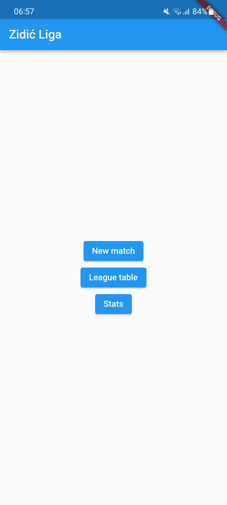
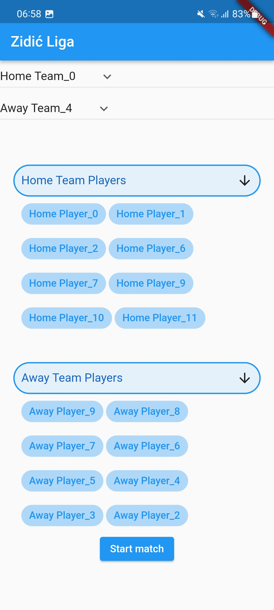
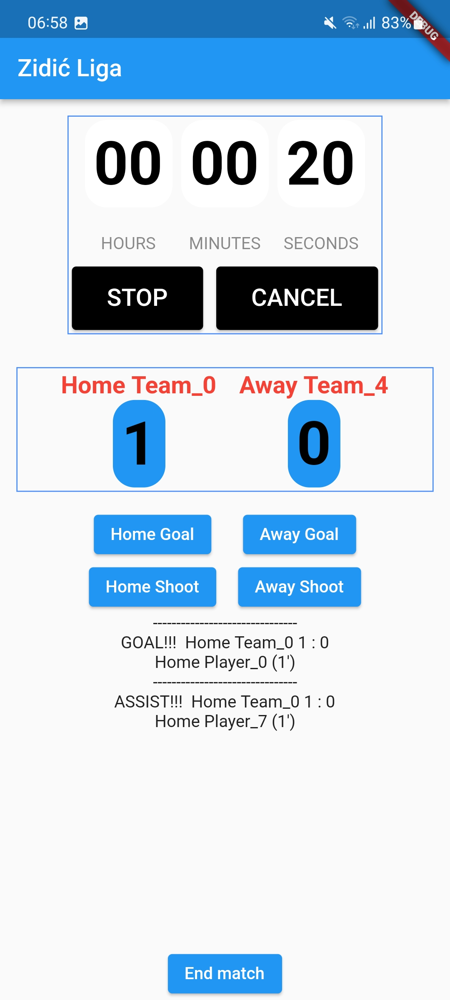
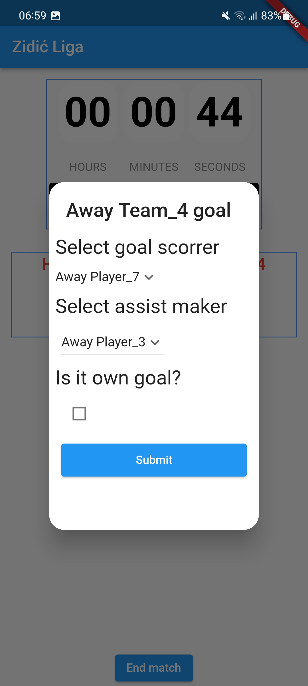

# Futsal league
## _Create futsal match and track stats and time of the match_

Futsal league is Flutter app that allows user to create futsal match by matching up different teams, adding players and tracking time and stats.

It was created for a speciffic futsal league that i participated in but it can be used anywhere.

## Features

- select teams that are playing
- select player playing for each team
- take notes of game events like goals, assists and own goals
- take notes of a player that scored a goal or created an assist
- track match time
- start, stop game timer, monito match

### Homepage

### Create match

### Monitor match

### Create match event
